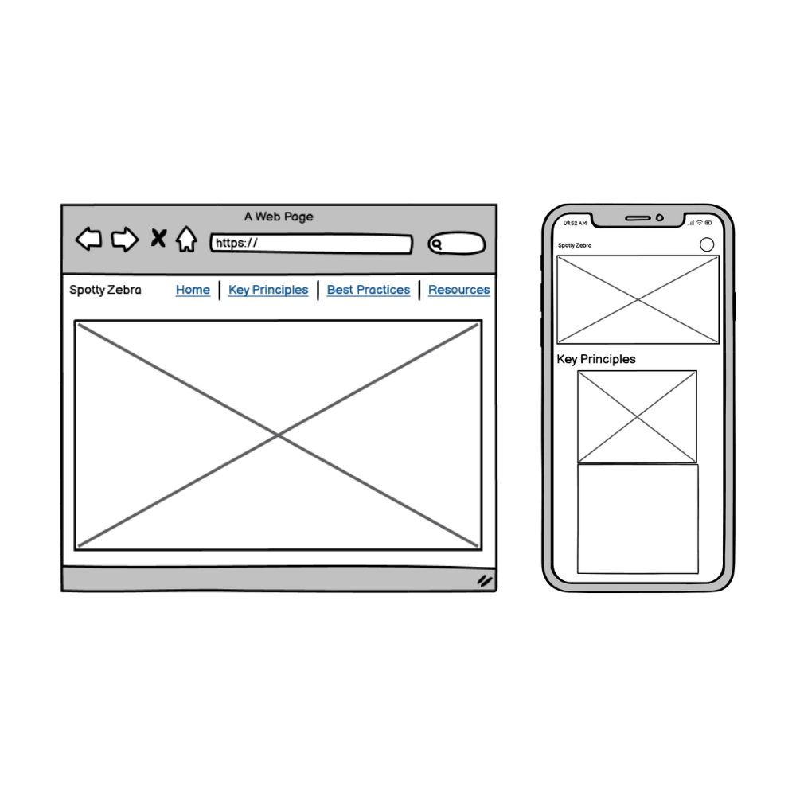
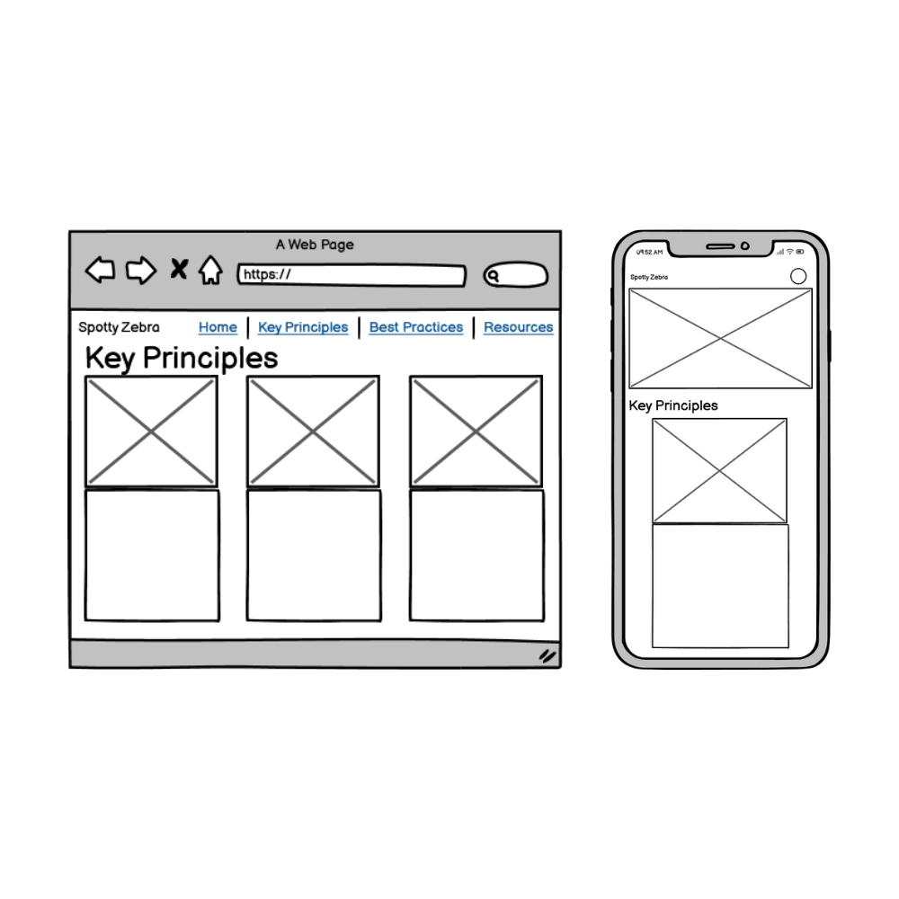
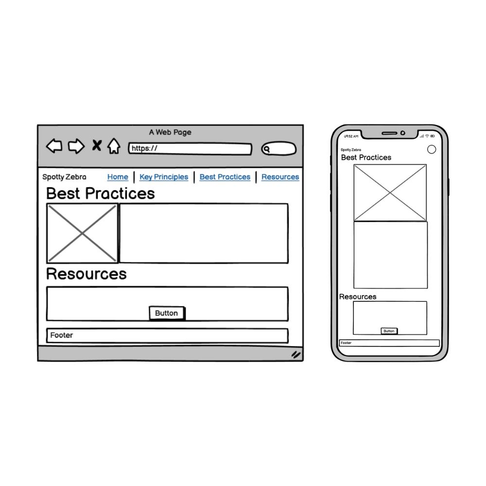
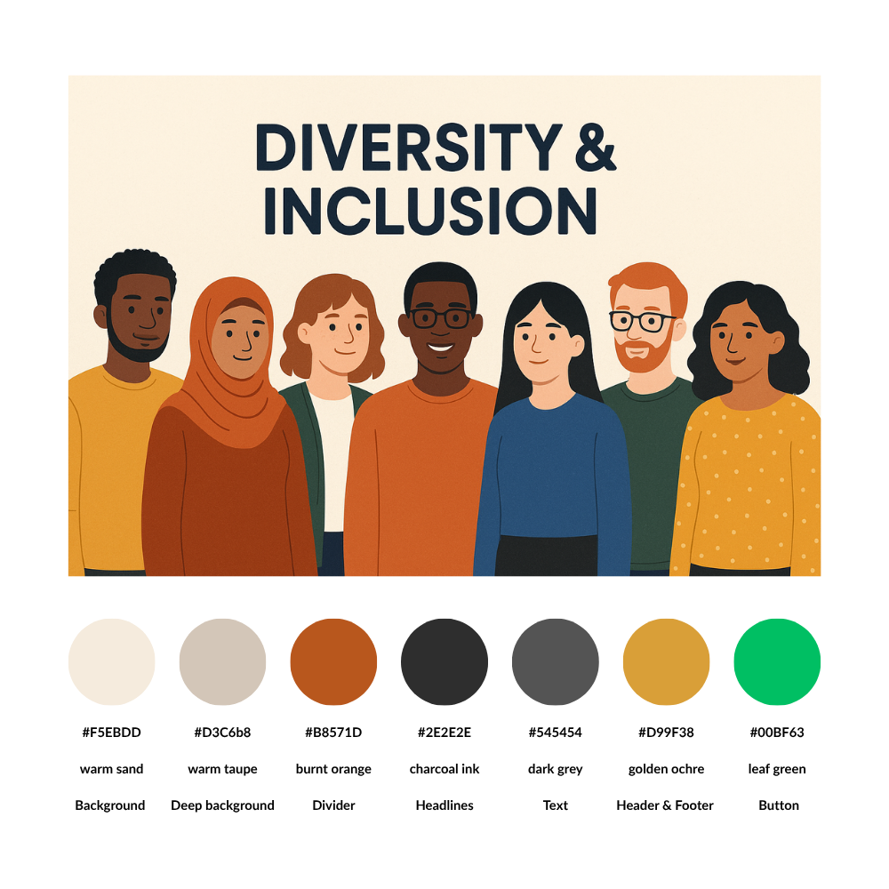

# Spotty Zebra

A vibrant, accessible, and informative one-page website designed to champion **Diversity & Inclusion (D&I)** across workplaces and educational settings. **Spotty Zebra** equips visitors with key principles, practical tips, and curated resources to foster inclusive environments.

---

## Table of Contents

1. [Live Demo](#live-demo)  
2. [Project Goals](#project-goals)  
3. [User Stories](#user-stories)  
4. [Wireframes](#wireframes) 
5. [Color Palette](#color-palette)  
6. [Features](#features)  
7. [Design & Implementation](#design--implementation)  
   - [Front-End Design](#front-end-design)  
   - [User Experience](#user-experience)  
   - [Accessibility](#accessibility)  
   - [Responsive Design](#responsive-design)  
8. [Validation & Testing](#validation--testing)  
   - [HTML & CSS Validation](#html--css-validation)  
   - [Performance Testing](#performance-testing)  
9. [Deployment](#deployment)  
10. [Project Structure](#project-structure)  
11. [Technologies Used](#technologies-used)  
12. [AI Integration](#ai-integration)    
13. [Future Improvements](#future-improvements)  
14. [Acknowledgements](#acknowledgements)

---

## Live Demo

👉 [https://nadiaglitch.github.io/spotty-zebra/](https://nadiaglitch.github.io/spotty-zebra/)

---

## Project Goals

- **LO1:** Build a one-page interactive front-end web app with semantic HTML, responsive CSS/Bootstrap, and WCAG-compliant accessibility.  
- **LO2:** Validate HTML/CSS with zero errors; ensure consistent UX across devices.  
- **LO3:** Deploy to a cloud platform (GitHub Pages), maintain clean Git history, and remove commented-out code.  
- **LO4:** Provide clear documentation (README, screenshots, attributions) to maximize maintainability.  
- **LO5:** Leverage AI tools strategically for code creation, debugging, performance optimization, and workflow efficiency.

---

## User Stories

### External Users

1. **Learn Core Concepts**  
   *As a new visitor,* I want to understand D&I fundamentals quickly so I can appreciate their importance.  
2. **Explore Key Principles**  
   *As a curious learner,* I want clear sections explaining D&I principles so I can digest information easily.  
3. **Gain Practical Tips**  
   *As a professional or student,* I want actionable tips in a concise list so I can apply them immediately.  
4. **Access Helpful Resources**  
   *As a self-guided learner,* I want obvious links to external resources so I can explore further.  
5. **Accessibility**  
   *As a user with impairments,* I want proper color contrast, alt text, and ARIA roles so I can navigate without barriers.

### Site Owner (Developer/Designer)

1. **Visual Engagement**  
   *As a site owner,* I want a compelling hero section so visitors immediately grasp the page’s purpose.  
2. **Structured Layout**  
   *As a front-end dev,* I want to use Bootstrap’s grid so content is balanced across devices.  
3. **Consistent Components**  
   *As a designer,* I want list groups for best practices so tips look uniform and readable.  
4. **Intuitive Navigation**  
   *As a creator,* I want styled buttons for resources so external links are easy to find.

---

## Wireframes

**Hero (Desktop & Mobile)**  
  

**Key Principles**  
  

**Best Practices & Resources**  
  

---

## Color Palette
  

---

## Features

- **Hero Section:** Full-width image with overlaid headline using Bootstrap utilities.  
- **Key Principles:** Three cards highlighting Equity, Belonging, and Representation.  
- **Best Practices:** List groups under leadership, data, and culture headings.  
- **Resources:** Bootstrap-styled buttons linking to HBS and UNESCO pages.  
- **Accessibility:** Alt text on all images, WCAG-compliant color contrast, semantic HTML.

---

## Design & Implementation

### Front-End Design

- **Semantic HTML5:** `<header>`, `<nav>`, `<main>`, `<section>`, `<footer>`  
- **Bootstrap 5.3.7:** Navbar, grid system, cards, list groups, buttons  

### User Experience

- **Clear Hierarchy:** Descriptive headings (`<h2>`, `<h3>`, `<h4>`).  
- **Immediate Feedback:** Navbar collapse toggles instantly; button hover states.

### Accessibility

- **Alt Text:** Every non-text element includes descriptive `alt` attributes.  
- **Color Contrast:** Background and text colors exceed 4.5:1 ratio.  
- **ARIA Roles:** Added to dynamic elements where necessary.

### Responsive Design

- **Media Queries & Bootstrap Grid:** Layout adapts at 320px, 480px, 768px, 992px breakpoints.  
- **Tested On:** Mobile, tablet, and desktop viewports.  


---

## Validation & Testing

### HTML & CSS Validation

- **W3C Validator:** 0 errors  
    
- **Jigsaw CSS Validator:** 4 errors  
  

Property font-optical-sizing is part of the CSS Fonts Module Level 4 (for variable fonts with optical-size axes), and the W3C validator (set to CSS 3) doesn’t know it.
Resolution: Wrap it in an @supports so browsers that understand it will apply it, and the validator will ignore it.

Parse error: in original code each shadow was on its own line ending with a semicolon but text-shadow is a single property that takes a comma-separated list of shadows, ending in one semicolon. Corrected.

---

### Performance Testing

- **Lighthouse (Mobile):**  
  - Performance: 70  
  - Accessibility: 93  
  - Best Practices: 96  
  - SEO: 100  
  

A mobile performance score of 70 falls into the “needs improvement” range. THis means that in future feaures, we need to prioritize deferring non-critical resources, optimizing images, and leveraging caching to significantly speed up load times.

---

## Deployment

1. **Version Control:**  
   ```bash
   git clone https://github.com/nadiaglitch/spotty-zebra.git
   cd spotty-zebra
   ``` 

2. **Clean Up: Removed all commented-out code before final commit.**

3. **Push to GitHub:**
```bash
git add .
git commit -m "Deploy Spotty Zebra v1.0"
git push origin main
``` 

5. **GitHub Pages: Enabled in repository settings; live at**
https://nadiaglitch.github.io/spotty-zebra/

---

## Project Structure

```bash
spotty-zebra/
│
├── assets/
│   ├── css/
│   │   └── style.css
│   ├── images/
│   │   ├── hero-image.png
│   │   ├── headshot-*.png
│   │   ├── responsive.png
│   │   ├── html-validator.png
│   │   ├── css-validator.png
│   │   ├── lighthouse-mobile.png
│   │   └── wireframes-*.png
│   └── favicon/
│       ├── favicon-16x16.png
│       ├── favicon-32x32.png
│       └── apple-icon-180x180.png
│
├── index.html
└── README.md
``` 

---

## Technologies Used

- **HTML5** – Semantic markup  
- **CSS3** – Flexbox, Grid, media queries  
- **Bootstrap 5.3.7** – Layout & components  
- **Font Awesome 6.5.0** – Iconography  
- **Google Fonts** – *Chelsea Market* & *Finlandica*  
- **Git & GitHub Pages** – Version control & hosting  
- **ChatGPT-4o** – AI-assisted code generation, debugging, and optimization  

---

## AI Integration

- **Code Creation:** Used AI to scaffold initial HTML structure and Bootstrap components, accelerating layout setup.  
- **Debugging:** Leveraged AI to identify CSS specificity clashes, missing ARIA attributes, and fixed navbar collapse issues.  
- **Optimization:** Received AI suggestions to reduce CSS redundancy and streamline media queries for smoother responsiveness.  
- **Workflow Impact:** AI assistance reduced iteration time, allowing more focus on UX refinements and accessibility.  

---

## Future Features

- Add interactive audio/video modules with custom playback controls.  
- Expand resources with search/filter functionality.  
- Integrate i18n for multilingual support.  
- Implement CI/CD pipeline with automated testing.  
- Enhance SEO metadata and structured data.  

---

## Acknowledgements
- **Code Institute:** *Marko Tot, Mark Briscoe, Roman Takic* for ongoing mentorship and guidance.
- **Harvard Business School:** *How to Champion D&I in the Workplace*  
- **UNESCO:** *Inclusion in Education*  
